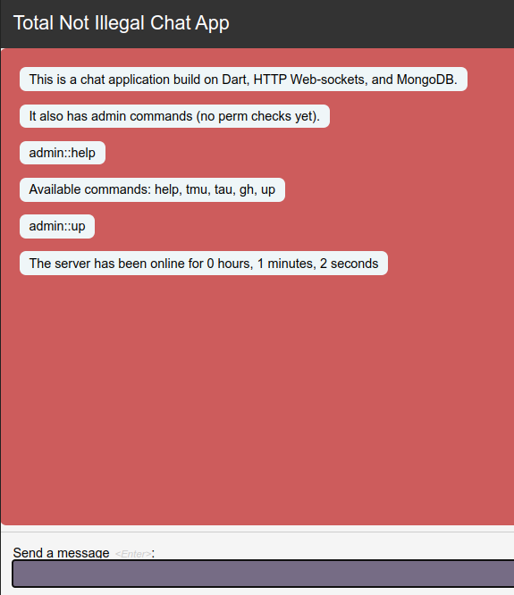
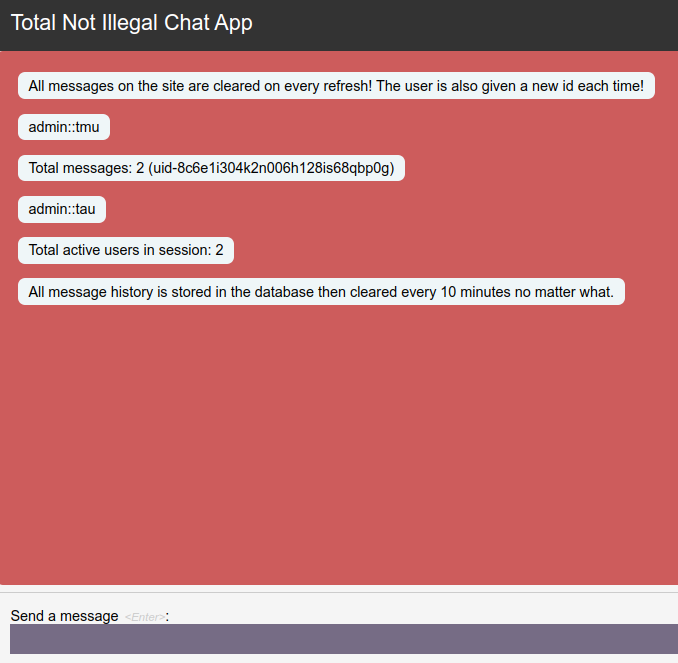

# `Totally Not Illegal Chat App`

A little chat app I made for my friends. It's not illegal, I swear.

Made this using [dart](https://dart.dev).

## Features

- [x] Send messages over web-sockets
- [x] Admin commands
- [x] Message history auto-wiped every 10 minutes
- [x] Random users generated every page refresh
- [x] Stable and secure

## How to run in development

### Simple Build (easier)

1. Go into the [/bin](./bin) directory.

2. Then download the binary .exe file (windows only) and run the file. It will start the webapp.

3. Go to `http://localhost:8080` in your browser.

This instance will be using my own hosted database and cant be configured since all the code is compiled into the binary. If you want to run your own instance, you will need to build it yourself. Keep it minds its not always safe to run random binaries from the internet, so if your paranoid, you can build it yourself using the instructions below.

### Self Build (harder)

1. Make sure you have the dark SDK installed.

2. Clone the repo.

3. Rename the `settings.dart.example` file to `settings.dart` and fill in the mongodb connection string.
*./lib/config/settings.dart.example*

4. Run `dart run ./lib/chat_app.dart` in the root directory.

5. Go to `http://localhost:8080` in your browser.

## Disclaimer

This application is not meant for production use. It is a proof of concept and should not be used in any way, shape, or form. I am not responsible for any damages caused by this application. Use at your own risk.

I created this application to help me learn the dart programming language and explore different aspects of the language and its ecosystem. If you see any improvements that can be made, please feel free to open a pull request as I created this whole app in my `3rd day` of learning dart.

In the future I would like to make a more robust chat application using the same concepts and ideas. I would most likely use a framework to help handle web-sockets, http requests, and other things. I would also like to add more features such as user accounts, private messages, and more. 

Thanks for checking this project out! Feel free to message me on discord `ThatGuyJamal#2695`.

### TODO

- [ ] Make system reply messages a different color than user messages
- [ ] admin commands locked by a password/token